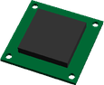
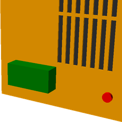

# Vitamin Catalogue

### Contents
 * [3DRRadio.scad ](#3drradioscad)
 * [APM25.scad ](#apm25scad)
 * [Breadboard.scad ](#breadboardscad)
 * [C2020BrushlessOutrunner.scad ](#c2020brushlessoutrunnerscad)
 * [DCMotor.scad ](#dcmotorscad)
 * [DYS16AESC.scad ](#dys16aescscad)
 * [DasMikroReceiver.scad ](#dasmikroreceiverscad)
 * [ESC.scad ](#escscad)
 * [FTDIBreakout.scad ](#ftdibreakoutscad)
 * [GPS.scad ](#gpsscad)
 * [IgusDrylinNCarriage.scad ](#igusdrylinncarriagescad)
 * [IgusDrylinNRail.scad ](#igusdrylinnrailscad)
 * [JumperWire.scad ](#jumperwirescad)
 * [LaserMirrorHolder.scad ](#lasermirrorholderscad)
 * [LaserPSU.scad ](#laserpsuscad)
 * [LinearBearing.scad ](#linearbearingscad)
 * [MicroServo.scad ](#microservoscad)
 * [Microswitch.scad ](#microswitchscad)
 * [N20DCGearMotor.scad ](#n20dcgearmotorscad)
 * [NeopixelRing.scad ](#neopixelringscad)
 * [ORing.scad ](#oringscad)
 * [StepperMotor.scad ](#steppermotorscad)
 * [StockMetal.scad ](#stockmetalscad)
 * [TowerProSG90Driver.scad ](#towerprosg90driverscad)
 * [TurnigyNanoTech120mAh2S25C.scad ](#turnigynanotech120mah2s25cscad)
 * [VGrooveBearing.scad ](#vgroovebearingscad)
 * [WFLYReceiver.scad ](#wflyreceiverscad)
 * [Ziptie.scad ](#ziptiescad)
 * [aluAngle.scad ](#aluanglescad)
 * [aluTube.scad ](#alutubescad)
 * [ball\_bearing.scad ](#ball_bearingscad)
 * [nut.scad ](#nutscad)
 * [screw.scad ](#screwscad)
 * [washer.scad ](#washerscad)
 * [wingnut.scad ](#wingnutscad)

## 3DRRadio.scad

Title | Call | Image
--- | --- | ---
3DR Radio | `3DRRadio()` | 

## APM25.scad

Title | Call | Image
--- | --- | ---
APM 2.5 | `APM25()` | 

## Breadboard.scad

Title | Call | Image
--- | --- | ---
Breadboard 170 | `Breadboard(Breadboard_170)` | 
Breadboard 270 | `Breadboard(Breadboard_270)` | 
Breadboard 400 | `Breadboard(Breadboard_400)` | 

## C2020BrushlessOutrunner.scad

Title | Call | Image
--- | --- | ---
C2020 Micro Brushless Outrunner 3500kv 11g | `C2020BrushlessOutrunner()` | 

## DCMotor.scad

Title | Call | Image
--- | --- | ---
R260 DC Motor | `DCMotor(DCMotor_R260)` | 
CL072014 DC Motor | `DCMotor(DCMotor_CL072014)` | 

## DYS16AESC.scad

Title | Call | Image
--- | --- | ---
DYS BLHeli 16A ESC | `DYS16AESC()` | 

## DasMikroReceiver.scad

Title | Call | Image
--- | --- | ---
DasMikro Ultra Mini 8CH PPM Receiver | `DasMikroReceiver()` | 

## ESC.scad

Title | Call | Image
--- | --- | ---
ESC | `ESC()` | 

## FTDIBreakout.scad

Title | Call | Image
--- | --- | ---
Sparkfun FTDI Breakout | `FTDIBreakout()` | 

## GPS.scad

Title | Call | Image
--- | --- | ---
GPS Module | `GPS()` | 

## IgusDrylinNCarriage.scad

Title | Call | Image
--- | --- | ---
Igus Drylin N Carriage NW-22-27-60P | `IgusDrylinNCarriage(IgusDrylinNCarriage_NW222760P)` | 

## IgusDrylinNRail.scad

Title | Call | Image
--- | --- | ---
Igus Drylin N Rail NS-01-17 100mm | `IgusDrylinNRail(IgusDrylinNRail_NS0127, length=100)` | 

## JumperWire.scad

Title | Call | Image
--- | --- | ---
JumperWire Male to Male 2pin 100mm | `JumperWire(type=JumperWire_MM2, length=100)` | 

## LaserMirrorHolder.scad

Title | Call | Image
--- | --- | ---
LaserMirrorHolder | `LaserMirrorHolder()` | 

## LaserPSU.scad

Title | Call | Image
--- | --- | ---
Laser PSU | `LaserPSU()` | 

## LinearBearing.scad

Title | Call | Image
--- | --- | ---
LM25UU Linear Bearing | `LinearBearing(LinearBearing_LM25UU)` | 
LM20UU Linear Bearing | `LinearBearing(LinearBearing_LM20UU)` | 
LM16UU Linear Bearing | `LinearBearing(LinearBearing_LM16UU)` | 
LM12UU Linear Bearing | `LinearBearing(LinearBearing_LM12UU)` | 
LM10UU Linear Bearing | `LinearBearing(LinearBearing_LM10UU)` | 
LM8UU Linear Bearing | `LinearBearing(LinearBearing_LM8UU)` | 
LM6UU Linear Bearing | `LinearBearing(LinearBearing_LM6UU)` | 
LM4UU Linear Bearing | `LinearBearing(LinearBearing_LM4UU)` | 

## MicroServo.scad

Title | Call | Image
--- | --- | ---
9g Micro Servo | `MicroServo()` | 

## Microswitch.scad

Title | Call | Image
--- | --- | ---
Microswitch | `Microswitch()` | 

## N20DCGearMotor.scad

Title | Call | Image
--- | --- | ---
N20DCGearMotor | `N20DCGearMotor()` | 

## NeopixelRing.scad

Title | Call | Image
--- | --- | ---
Neopixel Ring 16 | `NeopixelRing()` | 

## ORing.scad

Title | Call | Image
--- | --- | ---
O-Ring 2x10 | `ORing(section=2, bore=10)` | 

## StepperMotor.scad

Title | Call | Image
--- | --- | ---
NEMA17 Stepper Motor | `StepperMotor(StepperMotor_NEMA17)` | 
NEMA17S Stepper Motor | `StepperMotor(StepperMotor_NEMA17S)` | 
NEMA14 Stepper Motor | `StepperMotor(StepperMotor_NEMA14)` | 
NEMA11 Stepper Motor | `StepperMotor(StepperMotor_NEMA11)` | 

## StockMetal.scad

Title | Call | Image
--- | --- | ---
Aluminium Angle 20x20x3mm x 100mm | `StockMetal(type=StockMetal_Angle_20x20x3, size=100, material=Material_Alu)` | 
Aluminium Angle 30x20x1.5mm x 100mm | `StockMetal(type=StockMetal_Angle_30x20x1p5, size=100, material=Material_Alu)` | 
Aluminium Box Section 30x30x3mm x 100mm | `StockMetal(type=StockMetal_Box_30x30x3, size=100, material=Material_Alu)` | 
Aluminium Flat Bar 6x1mm x 100mm | `StockMetal(type=StockMetal_FlatBar_6x1, size=100, material=Material_Alu)` | 
Aluminium Channel 40x25x3x3mm x 100mm | `StockMetal(type=StockMetal_Channel_40x25x3x3, size=100, material=Material_Alu)` | 
Aluminium Channel 4x1x1/8x1/8 in x 100mm | `StockMetal(type=StockMetal_Channel_4x1x1d8x1d8i, size=100, material=Material_Alu)` | 
Aluminium Channel 4x2x1/8x1/8 in x 100mm | `StockMetal(type=StockMetal_Channel_4x2x1d8x1d8i, size=100, material=Material_Alu)` | 
Aluminium Round Bar 2mm x 100mm | `StockMetal(type=StockMetal_RoundBar_2, size=100, material=Material_Alu)` | 
Aluminium Round Bar 6mm x 100mm | `StockMetal(type=StockMetal_RoundBar_6, size=100, material=Material_Alu)` | 
Aluminium Round Bar 8mm x 100mm | `StockMetal(type=StockMetal_RoundBar_8, size=100, material=Material_Alu)` | 
Aluminium Round Bar 10mm x 100mm | `StockMetal(type=StockMetal_RoundBar_10, size=100, material=Material_Alu)` | 
Aluminium Round Bar 12mm x 100mm | `StockMetal(type=StockMetal_RoundBar_12, size=100, material=Material_Alu)` | 
Aluminium Round Bar 20mm x 100mm | `StockMetal(type=StockMetal_RoundBar_20, size=100, material=Material_Alu)` | 
Aluminium Tube 10x1mm x 100mm | `StockMetal(type=StockMetal_Tube_10x1, size=100, material=Material_Alu)` | 
Aluminium Tube 10x1.5mm x 100mm | `StockMetal(type=StockMetal_Tube_10x1p5, size=100, material=Material_Alu)` | 

## TowerProSG90Driver.scad

Title | Call | Image
--- | --- | ---
TowerPro SG90 Driver | `TowerProSG90Driver()` | 

## TurnigyNanoTech120mAh2S25C.scad

Title | Call | Image
--- | --- | ---
Turnigy Nano-Tech 120mAh 2S 25C Lipo Pack E-Flite Compatible | `TurnigyNanoTech120mAh2S25C()` | 

## VGrooveBearing.scad

Title | Call | Image
--- | --- | ---
624VV 4x13x6mm V Groove Sealed Ball Bearing | `VGrooveBearing(VGrooveBearing_624VV)` | 

## WFLYReceiver.scad

Title | Call | Image
--- | --- | ---
WFLY Receiver | `WFLYReceiver()` | 

## Ziptie.scad

Title | Call | Image
--- | --- | ---
2.5mm x 100mm Ziptie | `Ziptie(Ziptie_2p5, r=12, l=100, trim=false)` | 

## aluAngle.scad

Title | Call | Image
--- | --- | ---
Aluminium Angle undefxundefxundefmm x undefmm | `aluAngle(undef,undef,undef,undef)` | 

## aluTube.scad

Title | Call | Image
--- | --- | ---
Aluminium Tube undefmm OD undefmm ID x undefmm | `aluTube(undef,undef,undef)` | 

## ball_bearing.scad

Title | Call | Image
--- | --- | ---
Ball Bearing 623 | `ball_bearing(BB623)` | 
Ball Bearing 624 | `ball_bearing(BB624)` | 
Ball Bearing 608 | `ball_bearing(BB608)` | 
Ball Bearing 625_2RS | `ball_bearing(BB625_2RS)` | 
Ball Bearing 6205_2RS | `ball_bearing(BB6205_2RS)` | 

## nut.scad

Title | Call | Image
--- | --- | ---
M2 Nut | `nut(type=M2_nut,nyloc=false,brass=false )` | 
M2.5 Nut | `nut(type=M2p5_nut,nyloc=false,brass=false )` | 
M3 Nut | `nut(type=M3_nut,nyloc=false,brass=false )` | 
M4 Nut | `nut(type=M4_nut,nyloc=false,brass=false )` | 
M5 Nut | `nut(type=M5_nut,nyloc=false,brass=false )` | 
M6 Nut | `nut(type=M6_nut,nyloc=false,brass=false )` | 
M6 Half Nut | `nut(type=M6_half_nut,nyloc=false,brass=false )` | 
M8 Nut | `nut(type=M8_nut,nyloc=false,brass=false )` | 
M10 Nut | `nut(type=M10_nut,nyloc=false,brass=false )` | 

## screw.scad

Title | Call | Image
--- | --- | ---
M2 pan screw x 20mm | `screw(type=M2_pan_screw,length=20, hob_point=0 )` | 
M2.5 pan screw x 20mm | `screw(type=M2p5_pan_screw,length=20, hob_point=0 )` | 
M2.5 cap screw x 20mm | `screw(type=M2p5_cap_screw,length=20, hob_point=0 )` | 
M3 cap screw x 20mm | `screw(type=M3_cap_screw,length=20, hob_point=0 )` | 
M3 pan screw x 20mm | `screw(type=M3_pan_screw,length=20, hob_point=0 )` | 
M3 hex screw x 20mm | `screw(type=M3_hex_screw,length=20, hob_point=0 )` | 
M3 grub screw x 20mm | `screw(type=M3_grub_screw,length=20, hob_point=0 )` | 
M4 cap screw x 20mm | `screw(type=M4_cap_screw,length=20, hob_point=0 )` | 
M4 pan screw x 20mm | `screw(type=M4_pan_screw,length=20, hob_point=0 )` | 
M4 hex screw x 20mm | `screw(type=M4_hex_screw,length=20, hob_point=0 )` | 
M4 grub screw x 20mm | `screw(type=M4_grub_screw,length=20, hob_point=0 )` | 
M5 cap screw x 20mm | `screw(type=M5_cap_screw,length=20, hob_point=0 )` | 
M6 cap screw x 20mm | `screw(type=M6_cap_screw,length=20, hob_point=0 )` | 
M6 selftap screw T25 x 20mm | `screw(type=M6_selftap_screw,length=20, hob_point=0 )` | 
M8 cap screw x 20mm | `screw(type=M8_cap_screw,length=20, hob_point=0 )` | 
M8 hex screw x 20mm | `screw(type=M8_hex_screw,length=20, hob_point=0 )` | 
M10 cap screw x 20mm | `screw(type=M10_cap_screw,length=20, hob_point=0 )` | 
M5 low profile screw x 20mm | `screw(type=M5_lowprofile_screw,length=20, hob_point=0 )` | 
No2 pan wood screw x 20mm | `screw(type=No2_screw,length=20, hob_point=0 )` | 
No4 pan wood screw x 20mm | `screw(type=No4_screw,length=20, hob_point=0 )` | 
No6 pan wood screw x 20mm | `screw(type=No6_screw,length=20, hob_point=0 )` | 
No6 cs  wood screw x 20mm | `screw(type=No6_cs_screw,length=20, hob_point=0 )` | 
6-32 pan screw x 20mm | `screw(type=No632_pan_screw,length=20, hob_point=0 )` | 

## washer.scad

Title | Call | Image
--- | --- | ---
M2 Washer 6x0.5 | `washer(type=M2_washer)` | 
M2.5 Washer 5.9x0.5 | `washer(type=M2p5_washer)` | 
M3 Washer 7x0.5 | `washer(type=M3_washer)` | 
M3.5 Washer 8x0.5 | `washer(type=M3p5_washer)` | 
M4 Washer 9x0.8 | `washer(type=M4_washer)` | 
M5 Washer 10x1 | `washer(type=M5_washer)` | 
M5 Washer 20x1.4 | `washer(type=M5_penny_washer)` | 
M6 Washer 12x1.5 | `washer(type=M6_washer)` | 
M8 Washer 17x1.8 | `washer(type=M8_washer)` | 
M8 Washer 30x1.5 | `washer(type=M8_penny_washer)` | 
M10 Washer 21x2.2 | `washer(type=M10_washer)` | 
M3 Rubber Washer 10x1.5 | `washer(type=M3_rubber_washer)` | 

## wingnut.scad

Title | Call | Image
--- | --- | ---
Wingnut M4 | `wingnut(M4_wingnut)` | 

